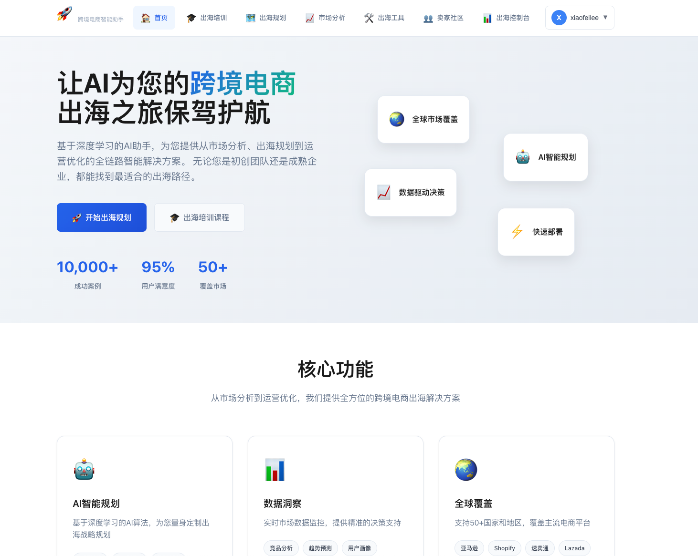
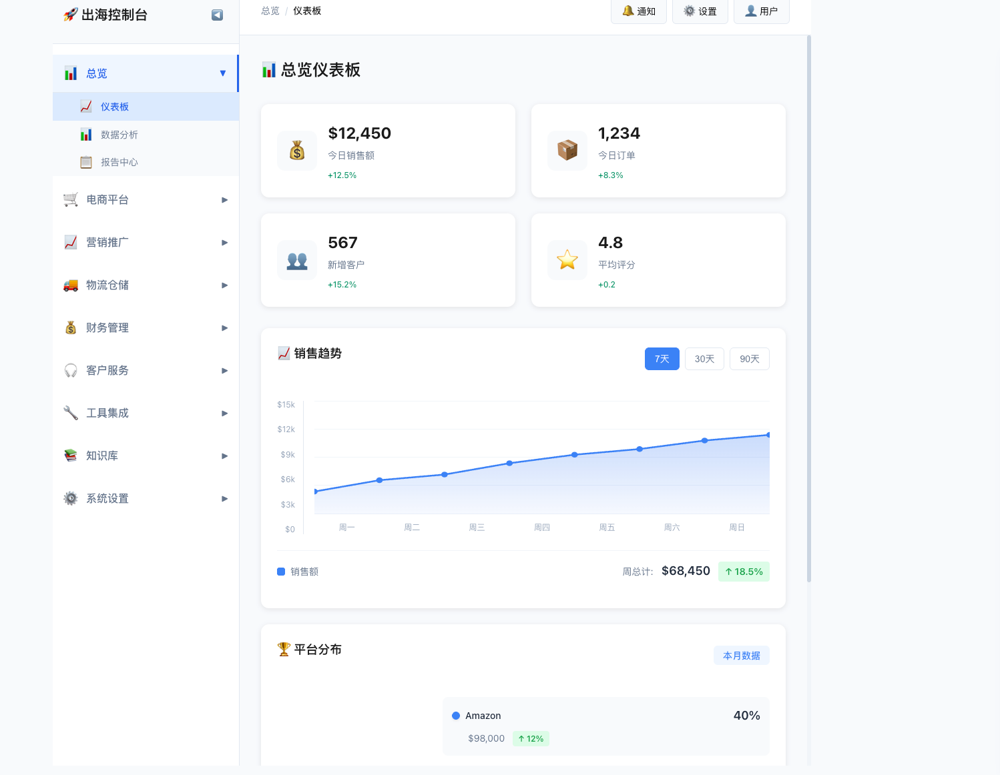
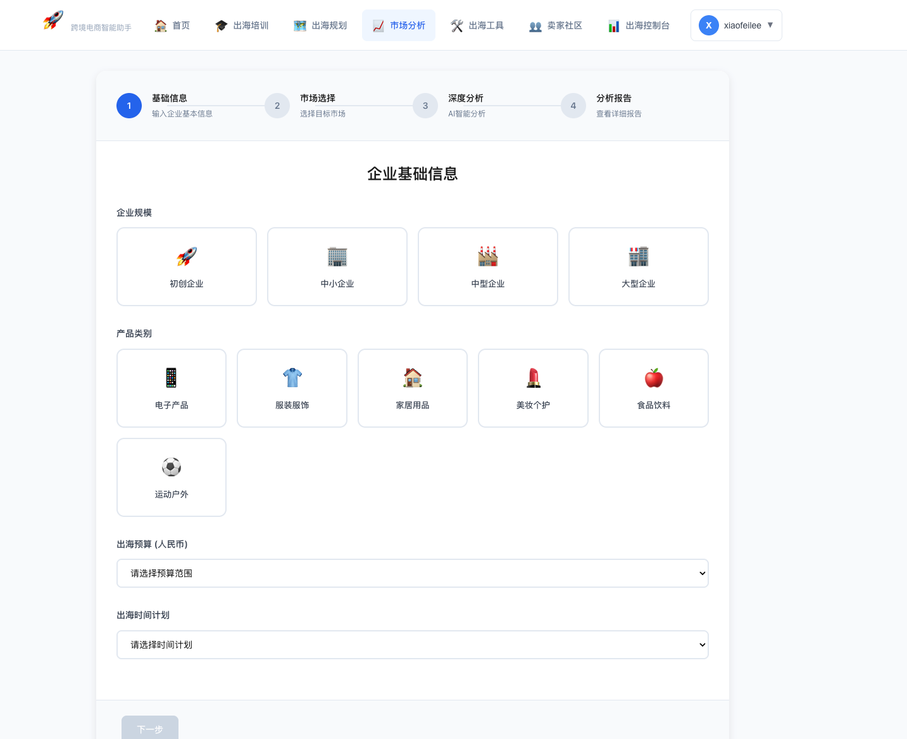

# 🌍 AI驱动的出海电商平台

<div align="center">


**用AI智能赋能全球电商出海**

[中文](./README.md) | [English](./README_EN.md)

</div>

---

## 📸 界面预览

<div align="center">

### 🏠 首页

*智能化的出海电商平台首页*

### 📊 智能仪表盘

*数据驱动的决策支持系统，包含美观的销售趋势图和平台分布图*

### 🎯 规划向导

*AI 驱动的出海规划助手*

### 📈 市场分析

*实时市场数据分析和洞察*

</div>

---

## 🚀 项目简介

AI驱动的出海电商平台是一个综合性解决方案，旨在通过智能自动化和数据驱动洞察帮助企业实现全球化扩张。该平台采用现代Web技术构建，由先进AI驱动，为成功的国际电商运营提供所需的一切功能。

## ✨ 核心功能

### 🤖 **AI智能规划向导**
- 多智能体AI系统，提供全面的出海规划
- 实时市场分析和策略建议
- 流式AI响应与Markdown渲染
- 将规划结果导出为结构化文档

### 📊 **高级市场分析**
- 目标市场识别和分析
- 竞争格局评估
- 消费者行为洞察
- 市场进入策略建议

### 🛠️ **综合工具套件**
- 分类的出海工具及详细指南
- AI驱动的工具使用问答
- 全球用户的多语言支持
- 可扩展的搜索功能

### 🏪 **卖家社区平台**
- 内容发布和管理
- AI驱动的内容生成和审核
- 用户互动和参与功能
- 基于分类的组织结构

### 🎓 **交互式培训系统**
- 6个综合培训模块
- 渐进式学习路径
- 交互式测验和评估
- 进度跟踪和完成证书

### 📈 **专业数据仪表盘**
- 多平台电商统一管理
- 美观的销售趋势折线图（SVG渲染，渐变效果）
- 平台分布环形图（支持交互）
- 客户服务自动化
- 营销活动管理
- 分析和报告工具

## 🏗️ 系统架构

```
┌─────────────────┐    ┌─────────────────┐    ┌─────────────────┐
│   前端界面      │    │   后端服务      │    │   AI服务        │
│   (React)       │◄──►│   (Node.js)     │◄──►│   (DeepSeek)    │
└─────────────────┘    └─────────────────┘    └─────────────────┘
         │                       │                       │
         ▼                       ▼                       ▼
┌─────────────────┐    ┌─────────────────┐    ┌─────────────────┐
│   UI组件库      │    │   API网关       │    │   大语言模型    │
│   - 规划向导    │    │   - REST API    │    │   - 市场分析    │
│   - 培训系统    │    │   - MySQL       │    │   - 策略规划    │
│   - 数据仪表盘  │    │   - 文件上传    │    │   - 运营建议    │
└─────────────────┘    └─────────────────┘    └─────────────────┘
```

## 🛠️ 技术栈

### 前端技术
- **React 18** - 现代化UI框架
- **Vite** - 快速构建工具
- **SVG图表** - 美观的数据可视化
- **CSS3** - 响应式设计与动画

### 后端技术
- **Node.js + Express** - API服务器
- **MySQL** - 关系型数据库
- **Sequelize** - ORM框架
- **Elasticsearch** - 向量搜索
- **Redis** - 缓存服务

### 中间件服务
- **MySQL 8.0** - 业务数据存储
- **Elasticsearch 8.13.0** - 搜索引擎与向量检索
- **Kibana 8.13.0** - 数据可视化
- **Redis 7** - 缓存与会话管理

### AI集成
- **DeepSeek API** - 大语言模型
- **多智能体架构** - 专业化AI代理
- **向量搜索** - 语义搜索能力

## 🚀 快速开始

### 环境要求
- Node.js 18+
- Docker & Docker Compose
- Git

### 安装步骤

#### 1. 克隆仓库
```bash
git clone https://github.com/Dawnflying/overseas-ai.git
cd overseas-ai
```

#### 2. 启动中间件服务
```bash
cd middleware
./start.sh start
```

#### 3. 安装依赖
```bash
# 后端依赖
cd ../backend
npm install

# 前端依赖
cd ../frontend
npm install
```

#### 4. 配置环境变量
```bash
# 复制并编辑环境配置文件
cp backend/.env.example backend/.env
# 填入你的API密钥和数据库配置
```

#### 5. 运行数据库迁移
```bash
cd backend
npm run db:migrate
npm run db:seed
```

#### 6. 启动应用
```bash
# 后端服务（终端1）
cd backend
npm start

# 前端服务（终端2）
cd frontend
npm run dev
```

#### 7. 访问应用
- 前端: http://localhost:5173
- 后端API: http://localhost:3000
- Kibana: http://localhost:5601

## 📁 项目结构

```
overseas-ai/
├── frontend/              # 前端应用
│   ├── src/
│   │   ├── components/    # React组件
│   │   ├── App.jsx
│   │   └── main.jsx
│   ├── Dockerfile
│   └── package.json
├── backend/               # 后端API服务
│   ├── config/           # 配置文件
│   ├── models/           # 数据模型
│   ├── services/         # 业务逻辑
│   ├── routes/           # API路由
│   ├── scripts/          # 工具脚本
│   ├── server.js
│   └── package.json
├── middleware/            # 中间件服务
│   ├── docker-compose.yml
│   ├── start.sh          # 管理脚本
│   ├── mysql/
│   ├── elasticsearch/
│   ├── kibana/
│   └── redis/
├── docs/                  # 文档
│   ├── setup/            # 环境搭建
│   ├── architecture/     # 架构设计
│   ├── deployment/       # 部署指南
│   └── middleware/       # 中间件文档
├── assets/                # 资源文件
│   ├── screenshots/      # 界面截图
│   ├── images/          # 图片资源
│   └── videos/          # 演示视频
├── docker-compose.yml     # 主docker配置
├── CHANGELOG.md          # 更新日志
└── CONTRIBUTING.md       # 贡献指南
```

## 📚 使用指南

### 1. **开始使用**
- 访问首页探索可用功能
- 使用AI规划向导制定出海策略
- 访问培训模块获取分步指导

### 2. **AI规划向导**
- 点击"开始出海规划"
- 填写业务信息
- AI智能体分析并提供建议
- 导出个性化规划文档

### 3. **市场分析**
- 进入"市场分析"模块
- 选择目标市场
- 查看详细的市场洞察和建议

### 4. **数据仪表盘**
- 登录访问高级功能
- 查看销售趋势和平台分布图表
- 管理多个电商平台
- 配置AI客服机器人
- 监控分析和性能

### 5. **培训系统**
- 访问"出海培训"
- 按顺序完成模块
- 参加测验检验知识
- 跟踪学习进度

## 🎨 图表功能

### 📈 销售趋势图
- SVG绘制的平滑曲线
- 渐变色彩填充效果
- 交互式数据点（悬停动画）
- 支持7天/30天/90天周期切换
- 实时数据汇总和增长率

### 🏆 平台分布图
- 彩色环形图展示
- 多平台销售占比可视化
- 详细的销售数据和趋势
- 悬停交互效果

## 🔧 配置说明

### AI服务配置
```javascript
// backend/config/index.js
ai: {
  deepseek: {
    apiKey: process.env.DEEPSEEK_API_KEY,
    baseUrl: 'https://api.deepseek.com/chat/completions',
    model: 'deepseek-chat',
    maxTokens: 2000,
    temperature: 0.7
  }
}
```

### 数据库配置
```javascript
// backend/config/index.js
database: {
  mysql: {
    host: process.env.MYSQL_HOST,
    port: 3306,
    database: 'overseas-ai',
    username: process.env.MYSQL_USERNAME,
    password: process.env.MYSQL_PASSWORD
  }
}
```

## 🐳 Docker部署

### 使用Docker Compose
```bash
# 启动所有服务
docker compose up -d

# 查看服务状态
docker compose ps

# 查看日志
docker compose logs -f

# 停止服务
docker compose down
```

### 生产环境部署
```bash
# 使用生产配置
docker compose -f docker-compose.prod.yml up -d
```

## 📖 文档导航

### 环境搭建
- [DeepSeek配置](./docs/setup/DEEPSEEK_SETUP.md)
- [GitHub配置](./docs/setup/GITHUB_SETUP.md)

### 架构设计
- [平台架构设计](./docs/architecture/ai-platform-design.md)
- [业务流程设计](./docs/architecture/overseas-planning-flow.md)
- [网站设计规划](./docs/architecture/website-design-plan.md)

### 部署文档
- [部署指南](./docs/deployment/DEPLOYMENT.md)
- [Docker构建指南](./docs/deployment/DOCKER_BUILD_GUIDE.md)
- [平台配置](./docs/deployment/DOCKER_PLATFORM_GUIDE.md)

### 中间件文档
- [中间件使用指南](./middleware/README.md)
- [MySQL集成指南](./docs/middleware/MYSQL_INTEGRATION_GUIDE.md)
- [向量搜索指南](./docs/middleware/VECTOR_SEARCH_GUIDE.md)
- [Elasticsearch构建](./docs/middleware/ELASTICSEARCH_BUILD_GUIDE.md)

## 🤝 参与贡献

我们欢迎社区贡献！请查看 [贡献指南](./CONTRIBUTING.md)。

### 贡献方式
1. **Bug报告**: 报告问题和错误
2. **功能建议**: 提出新功能想法
3. **代码贡献**: 提交Pull Request
4. **文档改进**: 完善文档说明
5. **测试协助**: 帮助测试和质量保证

### 开发流程
1. Fork本仓库
2. 创建特性分支 (`git checkout -b feature/amazing-feature`)
3. 提交更改 (`git commit -m '添加某某功能'`)
4. 推送到分支 (`git push origin feature/amazing-feature`)
5. 创建Pull Request

### 代码规范
- 遵循ESLint配置
- 使用有意义的提交信息
- 为新功能添加测试
- 及时更新相关文档

## 📊 数据模型

### 核心模型
- **User** - 用户管理
- **KnowledgeBase** - 知识库
- **Conversation** - 对话记录
- **Message** - 消息记录
- **ToolUsage** - 工具使用记录
- **FileUpload** - 文件上传记录
- **SystemConfig** - 系统配置

## 🌟 特色亮点

### 美观的数据可视化
- **销售趋势图**: SVG绘制的平滑折线图，支持周期切换
- **平台分布图**: 彩色环形图展示各平台销售占比
- **交互动画**: 悬停放大、渐变效果
- **响应式设计**: 适配各种屏幕尺寸

### 中间件统一管理
- 所有中间件服务集中在 `middleware/` 目录
- 一键启动/停止/管理脚本
- 完整的健康检查和日志功能
- Docker Compose统一编排

### 完善的文档体系
- 分类清晰的技术文档
- 详细的使用指南
- 完整的API文档
- 丰富的示例代码

## 🔒 安全配置

### 生产环境建议
1. 修改所有默认密码
2. 启用Elasticsearch安全认证
3. 配置防火墙规则
4. 使用SSL/TLS加密
5. 定期备份数据

### 环境变量
```env
# MySQL
MYSQL_HOST=your_mysql_host
MYSQL_DATABASE=overseas-ai
MYSQL_USERNAME=your_username
MYSQL_PASSWORD=your_password

# AI服务
DEEPSEEK_API_KEY=your_api_key

# OSS
OSS_BUCKET=overseas-ai
OSS_ACCESS_KEY_ID=your_access_key
OSS_ACCESS_KEY_SECRET=your_secret_key
```

## 🚀 性能优化

### 前端优化
- Vite快速构建
- 代码分割和懒加载
- 图片压缩和优化
- CSS动画硬件加速

### 后端优化
- 数据库连接池
- Redis缓存
- API响应压缩
- 请求速率限制

### 中间件优化
- Elasticsearch索引优化
- MySQL查询优化
- Redis内存管理
- 连接池配置

## 📈 监控和维护

### 健康检查
```bash
# 应用健康检查
curl http://localhost:3000/health

# 中间件健康检查
cd middleware
./start.sh health
```

### 日志查看
```bash
# 应用日志
docker compose logs -f backend

# 中间件日志
cd middleware
./start.sh logs mysql
./start.sh logs elasticsearch
```

## 🐛 故障排除

### 常见问题

1. **数据库连接失败**
   - 检查MySQL服务是否启动
   - 验证数据库凭据
   - 确认网络连接

2. **AI服务调用失败**
   - 检查API密钥配置
   - 验证网络连接
   - 查看速率限制

3. **图表不显示**
   - 检查浏览器控制台错误
   - 验证数据格式
   - 清除浏览器缓存

详细故障排除指南请查看 [文档](./docs/)。

## 📄 许可证

本项目采用 MIT 许可证 - 详见 [LICENSE](LICENSE) 文件。

## 🙏 致谢

- **DeepSeek** 提供AI能力支持
- **React社区** 提供优秀的工具和文档
- **开源贡献者** 提供灵感和工具
- **电商专家** 提供领域知识

## 📞 技术支持

- **文档**: [docs/](./docs/)
- **问题反馈**: [GitHub Issues](https://github.com/Dawnflying/overseas-ai/issues)
- **讨论区**: [GitHub Discussions](https://github.com/Dawnflying/overseas-ai/discussions)
- **中间件文档**: [middleware/README.md](./middleware/README.md)

## 🔗 相关链接

- [更新日志](./CHANGELOG.md)
- [贡献指南](./CONTRIBUTING.md)
- [文档整理说明](./DOCS_ORGANIZATION.md)
- [中间件文档](./middleware/README.md)
- [Git提交总结](./GIT_COMMIT_SUMMARY.md)

---

<div align="center">

Made with ❤️ by Overseas AI Team

**[⬆ 返回顶部](#-ai驱动的出海电商平台)**

</div>
